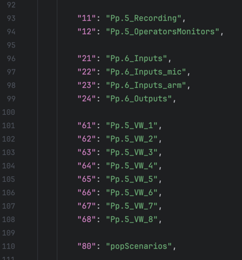

# Extron universal program example

This program adjusts the operating logic and the list of devices used in accordance with the data they read from the configuration file.

### Data file 
 - The name of the file should start with "ConfigData_", the second part of the file name does not influence to anything
 - The configuration file with the "import" key lists the modules that will be initialized for a specific room.
 - 
 - In accordance with the initialized modules, the devices necessary for operation are read from the configuration file

### UI navigation
 - The configuration file, in the "PpData" section, stores all the data necessary for navigating the user interface through pages and subpages
 - The next image shows an example of page data
 - 
 - The logic of the "PP.py" module allows you to have 9 main pages with unlimited support popups and 9 switchable popups.
 - The key "1" - is the button number that will be initialized by the program.
 - The key “Page” - is the name of the Page that will be displayed on the touch panel
 - The key “supportPP” - is the list of the support popups that will be displayed on the page
 - The key “defaultPp” - shows which switchable popups will be displayed in first time the Page is opened
 - Possible switchable popups for each page should be declared below, as shown in the picture.
 - 
 - Buttons will be initialized by the program according to dict keys.
 - The popups with keys 11 - 19 belong to page 1, and 91 - 99 to page 9 respectively

### Video Commutation - Extron Navigaton
 - All necessary data for video switching is contained in the "Global.py" file in the dictionary "VideoComData"
 - Key "Shiftbutton" - shows from which number the numbering of video switching buttons begins
 - Key "OUT" - contains a list of all possible out numbers and data for each output.
 - 
 - 
 - If the "name" key is not empty, then this text will be displayed on the videoOut button
 - The key "inputs" contains the list of the possible video inputs that can be switched to this video output and only these video inputs will be displayed on the "video input selector popup" when the out button was pressed
 - If the key "ConnectionType" contains "USB" - it means that Video Out has an additional option to connect a USB. If a Video Input has the same option then not only the video connection will established between them but also the USB.
 - The key "InputPP" - shows the popup that will be displayed when the Video Output button is pressed. If this field is empty then it will be default popup
 - The key "textFb" - shows if it needs to show the text FB of real commutation on the Video Out Button
 - The key "audio" - contains the audion commutation that should follow video commutation if needed. Audio commutation will be established only if the video input has the audio data description.
 - 
 - If the Video Output data has the field "additionalOut" and the Vodio Input data has the field "additionalInput" then between them will be established the video connection. This function is needed to establish a video connection for two monitors from two PC out in one click.

### Custom in/out console

 - The custom debug console started with the program on port 10000.
 - If you need to send message to the console then use the "SendDataToClients(cmd)" method
 - If you need to react to the message that was sent to controller then you need to override the "HandleReceiveData" method
